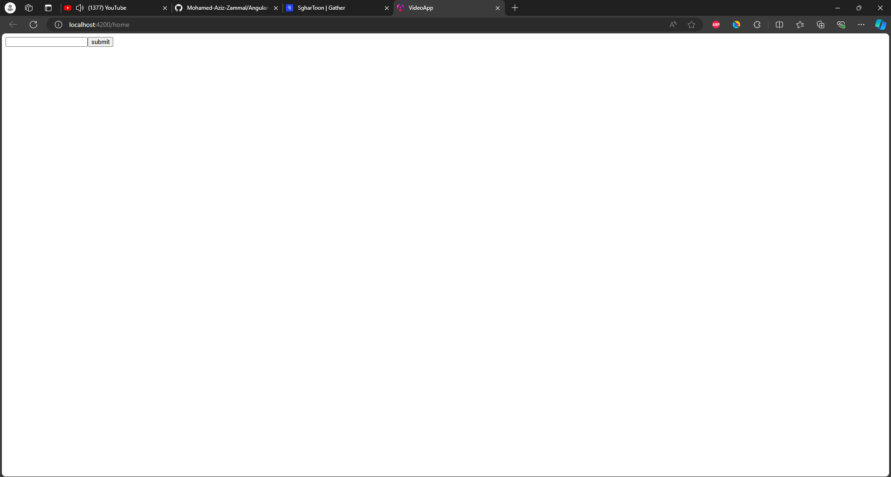
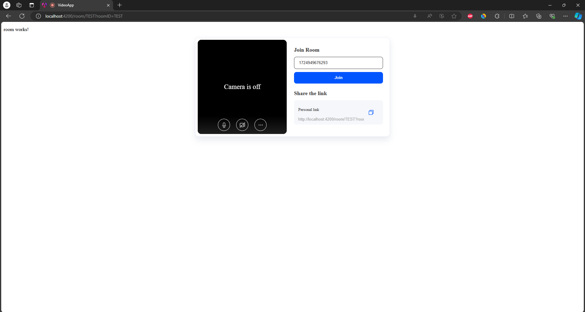
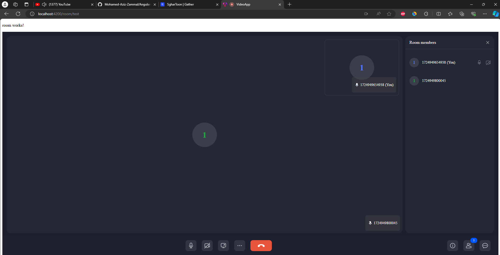

# Video Calling App with ZegoUIKitPrebuilt

## Overview
This project is an Angular-based video calling application that utilizes the ZegoUIKitPrebuilt SDK. The app allows users to join a video call by entering a room ID. It is designed with a simple interface where users can input a room ID and be redirected to the video call room.

## Features
- **Join Video Calls**: Users can join a video call by entering a room ID.
- **Prebuilt UI**: The app uses ZegoUIKitPrebuilt for a prebuilt video calling UI.
- **Dynamic Room IDs**: The app generates and uses dynamic room IDs to join calls.

## Technologies Used
- **Angular**: The primary framework used for building the application.
- **ZegoUIKitPrebuilt**: A prebuilt UI SDK for adding video calling features easily.
- **TypeScript**: The programming language used to develop the Angular app.

## How It Works

### Home Component
- The user enters a room ID in the input field.
- Upon submitting, the user is redirected to the video call room associated with that room ID.

### Room Component
- The room component generates a Kit Token using the provided `appID` and `serverSecret`.
- The ZegoUIKitPrebuilt SDK is used to create a video calling room with the specified room ID.
- The video call UI is embedded in the component's view.

## Installation

### Clone the Repository
```bash
git clone https://github.com/YourUsername/YourRepositoryName.git
cd YourRepositoryName
```

### Install Dependencies
```sh
npm install
```

### Start the Development Server
```sh
ng serve
```

## Screenshots

### Home Page


### Video Call Room




